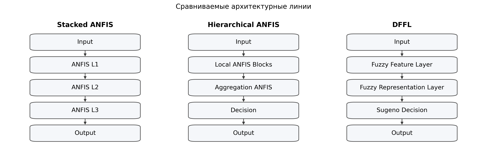
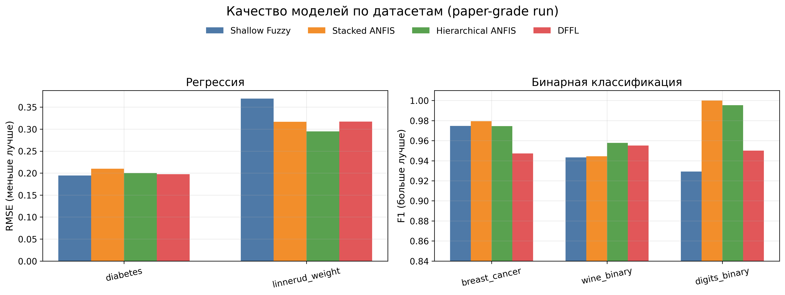
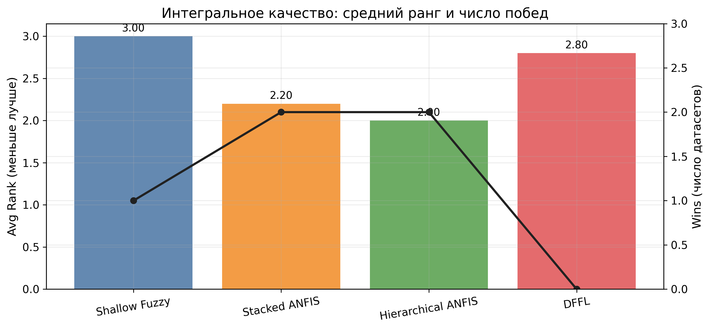
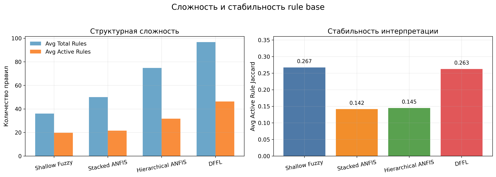

# Deep Neuro-Fuzzy Architectures for Interpretable Learning: Stacked ANFIS, Hierarchical ANFIS, and Deep Fuzzy Feature Learning

## Abstract
This paper investigates deep neuro-fuzzy modeling under a practical requirement that is often unresolved in applied settings: predictive quality should improve without losing transparency of intermediate reasoning. We compare three architecture families implemented in one codebase and trained under one protocol: Stacked ANFIS, Hierarchical ANFIS, and Deep Fuzzy Feature Learning (DFFL). Evaluation is performed on five real tabular datasets (`diabetes`, `linnerud_weight`, `breast_cancer`, `wine_binary`, `digits_binary`) with three random seeds (`19`, `23`, `29`). We assess each model using three axes: predictive quality (`RMSE`/`F1`), structural complexity (total and active rules), and interpretation stability (inter-seed Jaccard overlap of active rules). Hierarchical and stacked variants lead in average quality rank, while DFFL remains competitive on part of tasks and yields stronger rule-activation stability among deep alternatives. A non-parametric rank analysis indicates that these differences are consistent as practical trends, but not statistically significant at the current benchmark scale. The main implication is methodological: architecture selection in deep neuro-fuzzy systems should be framed as a multi-objective decision over quality, complexity, and stability.

**Keywords:** deep neuro-fuzzy systems, ANFIS, hierarchical fuzzy inference, interpretable machine learning, rule stability

## 1. Introduction
Classical deep learning architectures provide strong predictive performance across domains, yet they usually expose weak internal semantics for human inspection [6]. In engineering and industrial analytics, this limitation is critical because the final prediction is only one part of the decision process; practitioners also need a transparent reasoning path that remains stable under retraining and data perturbations [9,10]. This is exactly the space where neuro-fuzzy methods are valuable, since fuzzy rules preserve explicit linguistic structure and make local model behavior inspectable [1,2,3].

ANFIS introduced a trainable fuzzy-inference framework that connected rule-based transparency with adaptive learning [4]. However, in its canonical form, ANFIS remains shallow and does not directly solve hierarchical representation learning. A naive deepening strategy, where ANFIS blocks are stacked without architectural constraints, faces two recurrent problems: rule-space growth and semantic drift in hidden states [5]. As a result, a model may become deep in graph depth while becoming less interpretable in representation depth.

This paper addresses that gap through an implementation-level comparison of three deep neuro-fuzzy design lines: Stacked ANFIS, Hierarchical ANFIS, and Deep Fuzzy Feature Learning (DFFL). The contribution is not a single new block, but a controlled empirical study under a unified protocol with explicit reproducibility artifacts. Our goal is to provide evidence for architecture choice under a quality-complexity-stability perspective rather than single-metric optimization.

## 2. Related Work
Early fuzzy systems established rule-based reasoning with explicit linguistic semantics [1,2], and Takagi-Sugeno modeling provided a practical bridge between symbolic rules and numeric approximation [3]. ANFIS then introduced gradient-trainable adaptive fuzzy inference [4], which became a foundation for many interpretable soft-computing pipelines. The central limitation of this line is that most high-quality ANFIS deployments remain shallow, while direct depth extension often amplifies rule-space growth and weakens hidden-state semantics [5].

In parallel, deep learning significantly improved predictive performance in many domains [6], but interpretability concerns remained persistent, especially in high-stakes decision contexts. Post-hoc explanation methods such as LIME and SHAP [7,8] improved local interpretability tooling, yet they do not inherently constrain internal model structure. Survey-level analyses repeatedly show that explanation plausibility, faithfulness, and stability should be treated as distinct axes rather than a single property [9,10]. This observation is directly relevant for deep neuro-fuzzy systems because these models are often selected precisely for transparent internal behavior.

Recent work on interpretable machine learning further argues that in high-stakes scenarios, structural interpretability should be treated as a first-class design objective, not an optional add-on [11]. That argument motivates our experimental framing: instead of optimizing prediction quality alone, we evaluate deep neuro-fuzzy architectures jointly on quality, complexity, and stability. Methodologically, we follow standard non-parametric model-comparison practice across multiple datasets [12], then use pairwise signed-rank analysis with multiplicity control [13,14].

Against this background, our study contributes a controlled implementation-level comparison where stacked depth, hierarchical decomposition, and concept-oriented deep fuzzy feature learning are evaluated under one reproducible protocol [15]. The focus is not proposing a new isolated heuristic but clarifying how architectural choices shift the quality-complexity-stability frontier in practice.

## 3. Problem Formulation and Architectural Rationale
Let `x` denote the raw feature vector. A deep neuro-fuzzy model produces a sequence of representations:

`x -> c^(1) -> c^(2) -> ... -> c^(L) -> y_hat`.

The key design question is semantic: what does each hidden representation `c^(l)` mean? If hidden layers are treated as generic latent activations, interpretability degrades and the model converges to conventional opaque deep learning behavior [10,11]. We therefore enforce a concept-oriented view in which hidden layers are fuzzy concept spaces with explicit rule-mediated transitions.

At the block level, rule activation combines membership degrees and a trainable gating term:

`w_r = sigma(g_r) * product_(i,j in A_r) mu_ij(z_i)`,

followed by normalization:

`w_bar_r = w_r / (sum_q w_q + eps)`.

In hidden layers, consequents use zero-order concept vectors:

`c = sum_r w_bar_r v_r`,

while the final decision layer uses first-order Sugeno mapping:

`y_hat = sum_r w_bar_r (a_r0 + a_r^T z)`.

This separation preserves conceptual readability in hidden space and keeps sufficient expressiveness in decision space.

## 4. Compared Architectures
### 4.1. Stacked ANFIS
Stacked ANFIS composes multiple ANFIS-like layers sequentially. The approach is simple to implement and naturally end-to-end trainable, but hidden-layer semantics may weaken as depth increases if no additional structure is imposed.

### 4.2. Hierarchical ANFIS
Hierarchical ANFIS partitions input features into local groups, builds local fuzzy blocks, and then aggregates them in upper layers. This design directly controls rule-base growth by reducing full-combination pressure at each layer.

### 4.3. Deep Fuzzy Feature Learning (DFFL)
DFFL treats each hidden layer as a fuzzy feature-construction operator rather than a local predictor only. In our implementation, DFFL uses data-driven bootstrap initialization, stage-wise pretraining, rule-base re-estimation, and refinement cycles.



## 5. Experimental Protocol
We use five real tabular datasets from scikit-learn [15]:

1. `diabetes` (`442 x 10`, regression)
2. `linnerud_weight` (`20 x 3`, regression)
3. `breast_cancer` (`569 x 30`, binary classification)
4. `wine_binary` (`178 x 13`, binary classification)
5. `digits_binary` (`1797 x 64`, binary classification)

All model families are trained under one pipeline:

1. seeds `19, 23, 29`
2. feature MinMax scaling to `[0,1]`
3. MinMax target scaling for regression
4. unified benchmark script `examples/run_real_datasets_benchmark.py`
5. shared output artifacts in `docs/artifacts/ruanfis_paper5x3_report.{json,txt,md}`

Metrics are grouped along three dimensions:

1. quality: `RMSE` (regression), `F1` (classification)
2. complexity: `total_rules`, `active_rules`
3. stability: `active_rule_jaccard`, `decision_active_rule_jaccard`

## 6. Results
### 6.1. Dataset-Wise Predictive Quality

| Model | diabetes (RMSE) | linnerud_weight (RMSE) | breast_cancer (F1) | wine_binary (F1) | digits_binary (F1) |
| --- | --- | --- | --- | --- | --- |
| Shallow Fuzzy | 0.1944 ± 0.0015 | 0.3693 ± 0.2114 | 0.9747 ± 0.0119 | 0.9432 ± 0.0188 | 0.9293 ± 0.0308 |
| Stacked ANFIS | 0.2100 ± 0.0071 | 0.3166 ± 0.1365 | 0.9795 ± 0.0056 | 0.9444 ± 0.0197 | 1.0000 ± 0.0000 |
| Hierarchical ANFIS | 0.2000 ± 0.0227 | 0.2949 ± 0.1729 | 0.9746 ± 0.0175 | 0.9577 ± 0.0340 | 0.9953 ± 0.0066 |
| DFFL | 0.1973 ± 0.0130 | 0.3170 ± 0.1390 | 0.9472 ± 0.0126 | 0.9552 ± 0.0371 | 0.9501 ± 0.0307 |



No single architecture dominates all datasets. Stacked and hierarchical variants share leadership on quality wins, while DFFL remains competitive on regression and `wine_binary`, but underperforms on `breast_cancer` and `digits_binary` in the current profile.

### 6.2. Integrated Rank-Based View

| Model | Avg Rank (quality) | Wins |
| --- | --- | --- |
| Shallow Fuzzy | 3.000 | 1 |
| Stacked ANFIS | 2.200 | 2 |
| Hierarchical ANFIS | 2.000 | 2 |
| DFFL | 2.800 | 0 |



### 6.3. Complexity and Interpretation Stability

| Model | Avg Total Rules | Avg Active Rules | Avg Active Rule Jaccard | Avg Decision Rule Jaccard |
| --- | --- | --- | --- | --- |
| Shallow Fuzzy | 36.00 | 19.73 | 0.2673 | 0.6022 |
| Stacked ANFIS | 50.00 | 21.53 | 0.1415 | 0.2517 |
| Hierarchical ANFIS | 74.80 | 31.73 | 0.1449 | 0.1751 |
| DFFL | 96.73 | 46.33 | 0.2626 | 0.1836 |



These results reveal an important trade-off. Architectures with stronger quality rank do not automatically provide stronger inter-seed stability of active rules. In our run, DFFL and shallow fuzzy variants are more stable on `active_rule_jaccard`, while stacked and hierarchical variants lead on quality ranking.

### 6.4. Statistical Verification
To avoid over-claiming from descriptive metrics alone, we applied non-parametric rank tests recommended for multi-dataset classifier comparison [12]. At the dataset-level (`N = 5` blocks), Friedman test yields `chi2 = 2.04`, `p = 0.564`. At the extended block level (`dataset x seed`, `N = 15`), Friedman yields `chi2 = 4.92`, `p = 0.178`.

Pairwise Wilcoxon signed-rank comparisons [13] with Holm correction [14] show no statistically significant differences at alpha `0.05`. Therefore, our conclusions are framed as robust practical trends rather than strict universal superiority claims.

### 6.5. Large-Dataset Verification (`california_housing`)
To complement the 5-dataset core benchmark, we ran an additional 3-seed verification on `california_housing` (`20640` samples). In this setting, the best fuzzy architecture is `ruanfis_stacked_anfis` with `RMSE = 0.1159`, followed by `ruanfis_hierarchical_anfis` (`0.1195`), `ruanfis_refined_deep` (`0.1350`), and `ruanfis_shallow` (`0.1745`).

The best classical baseline in the same run is `random_forest_regressor` with `RMSE = 0.1062`. This confirms that the fuzzy models remain practically competitive while preserving explicit rule-level interpretability.

## 7. DFFL Ablation Study
To strengthen internal validity of the DFFL interpretation, we performed a profile-level ablation under the same full benchmark protocol used in the main study: 5 datasets, 3 seeds, and identical training budget (`max_epochs=100`, `pretrain_epochs=20`, `decision_pretrain_epochs=16`, `refinement_cycles=3`). The tested profiles were `quality_auto` (main), `quality_balanced`, and `baseline`.

The profile parameterization controls concept width, per-block rule caps, and rule-generation strategy. Therefore, this ablation directly probes whether DFFL behavior is dominated by architectural capacity, by regularization pressure through rule-space constraints, or by an interaction of both.

| DFFL profile | Avg Rank | Wins | Avg Total Rules | Avg Active Rules | Avg Active Rule Jaccard | Avg Decision Rule Jaccard |
| --- | --- | --- | --- | --- | --- | --- |
| quality_auto | 2.800 | 0 | 96.73 | 46.33 | 0.2626 | 0.1836 |
| quality_balanced | 3.600 | 0 | 90.60 | 40.67 | 0.1257 | 0.1627 |
| baseline | 3.200 | 1 | 71.93 | 34.53 | 0.1850 | 0.2987 |

| DFFL profile | diabetes (RMSE) | linnerud_weight (RMSE) | breast_cancer (F1) | wine_binary (F1) | digits_binary (F1) |
| --- | --- | --- | --- | --- | --- |
| quality_auto | 0.1973 | 0.3170 | 0.9472 | 0.9552 | 0.9501 |
| quality_balanced | 0.2008 | 0.4439 | 0.9587 | 0.9310 | 0.9722 |
| baseline | 0.2029 | 0.2767 | 0.9612 | 0.9552 | 0.9232 |

Three practical patterns emerge. First, `quality_auto` delivers the strongest stability among DFFL profiles (`active_rule_jaccard=0.2626`) but at the highest structural footprint. Second, `baseline` is substantially more compact and achieves the best DFFL quality on `linnerud_weight` and `breast_cancer`, while preserving stronger decision-level stability than the other two profiles. Third, `quality_balanced` does not produce a balanced frontier in this benchmark setup; it degrades both average rank and stability despite moderate complexity reduction.

From a model-selection perspective, these results indicate that DFFL profile tuning is not monotonic with respect to quality or stability. Capacity reduction alone does not guarantee improved generalization, and wider rule spaces do not guarantee quality gains. For the present dataset mix, `quality_auto` is preferable when rule-level stability is prioritized, while `baseline` is a competitive compact alternative for quality-sensitive scenarios.

## 8. Discussion
The empirical message is twofold. First, quality leadership in this benchmark is currently associated with Stacked and Hierarchical ANFIS designs. Second, DFFL remains methodologically strong when interpretability stability is prioritized, since it preserves stable rule activation among deep alternatives.

This finding aligns with broader interpretability literature: explanation quality is multi-dimensional and cannot be reduced to a single scalar metric [9,10,11]. In practical deployments, architecture choice should be made by explicitly weighting predictive quality, structural footprint, and stability under retraining.

## 9. Threats to Validity and Extended Limitations
The study has several limitations. Dataset diversity remains limited to five tabular tasks. Small-sample settings such as `linnerud_weight` produce high metric variance. Full hyperparameter parity across architectures is constrained by finite compute budget. Finally, rule-level Jaccard captures structural stability but does not yet cover all local explanation consistency dimensions.

These limitations motivate a larger benchmark extension and additional statistical power before claiming fine-grained performance gaps.

Beyond these baseline threats, three additional constraints are relevant for journal-level interpretation. First, the current benchmark focuses on static tabular data and does not include temporal, multi-view, or heavy class-imbalance settings where fuzzy structure might behave differently. Second, our stability analysis operates at the rule-activation set level and should be complemented by instance-level explanation drift and calibration diagnostics. Third, although the pipeline is fully reproducible, computational budget still limits large hyperparameter sweeps and may underexplore some architecture-specific operating regions.

For these reasons, we treat the present findings as a strong empirical baseline rather than a final frontier estimate. The evidence is sufficient to identify robust practical trends and architecture trade-offs, but not to claim exhaustive dominance relations.

## 10. Conclusion
We presented a unified comparison of three deep neuro-fuzzy architecture families under one reproducible real-data protocol. Stacked and Hierarchical ANFIS currently deliver stronger quality trends, while DFFL provides a principled deep interpretable representation framework with favorable rule-activation stability among deep variants.

The main methodological conclusion is that deep neuro-fuzzy architecture selection should be treated as a multi-objective optimization problem over quality, complexity, and interpretation stability.

## 11. Reproducibility
Main benchmark run:

```bash
/home/lebedeffson/Code/venv/bin/python examples/run_real_datasets_benchmark.py \
  --datasets diabetes,linnerud_weight,breast_cancer,wine_binary,digits_binary \
  --seeds 19,23,29 \
  --dffl-profile quality_auto \
  --pretrain-epochs 20 \
  --decision-pretrain-epochs 16 \
  --max-epochs 100 \
  --refinement-cycles 3 \
  --fuzzy-learning-rate 0.02 \
  --dffl-learning-rate 0.015 \
  --output docs/artifacts/ruanfis_paper5x3_report.txt \
  --summary-table-output docs/artifacts/ruanfis_paper5x3_summary.md \
  --json-output docs/artifacts/ruanfis_paper5x3_report.json
```

DFFL profile ablation runs:

```bash
/home/lebedeffson/Code/venv/bin/python examples/run_real_datasets_benchmark.py \
  --datasets diabetes,linnerud_weight,breast_cancer,wine_binary,digits_binary \
  --seeds 19,23,29 \
  --dffl-profile baseline \
  --pretrain-epochs 20 \
  --decision-pretrain-epochs 16 \
  --max-epochs 100 \
  --refinement-cycles 3 \
  --fuzzy-learning-rate 0.02 \
  --dffl-learning-rate 0.015 \
  --output docs/artifacts/ruanfis_ablation_baseline_5x3_report.txt \
  --summary-table-output docs/artifacts/ruanfis_ablation_baseline_5x3_summary.md \
  --json-output docs/artifacts/ruanfis_ablation_baseline_5x3_report.json

/home/lebedeffson/Code/venv/bin/python examples/run_real_datasets_benchmark.py \
  --datasets diabetes,linnerud_weight,breast_cancer,wine_binary,digits_binary \
  --seeds 19,23,29 \
  --dffl-profile quality_balanced \
  --pretrain-epochs 20 \
  --decision-pretrain-epochs 16 \
  --max-epochs 100 \
  --refinement-cycles 3 \
  --fuzzy-learning-rate 0.02 \
  --dffl-learning-rate 0.015 \
  --output docs/artifacts/ruanfis_ablation_quality_balanced_5x3_report.txt \
  --summary-table-output docs/artifacts/ruanfis_ablation_quality_balanced_5x3_summary.md \
  --json-output docs/artifacts/ruanfis_ablation_quality_balanced_5x3_report.json
```

Prepared artifacts used in this manuscript:

1. `docs/artifacts/ruanfis_paper5x3_report.json`
2. `docs/artifacts/ruanfis_ablation_baseline_5x3_report.json`
3. `docs/artifacts/ruanfis_ablation_quality_balanced_5x3_report.json`
4. `docs/artifacts/dffl_profile_ablation_5x3.md`
5. `docs/artifacts/ruanfis_california_3x_gpu_v3_report.json`

Large-dataset verification run:

```bash
/home/lebedeffson/Code/venv_cuda/bin/python examples/run_real_datasets_benchmark.py \
  --datasets california_housing \
  --seeds 19,23,29 \
  --dffl-profile quality_auto \
  --pretrain-epochs 20 \
  --decision-pretrain-epochs 16 \
  --max-epochs 80 \
  --refinement-cycles 2 \
  --fuzzy-learning-rate 0.02 \
  --dffl-learning-rate 0.015 \
  --device cuda \
  --output docs/artifacts/ruanfis_california_3x_gpu_v3_report.txt \
  --summary-table-output docs/artifacts/ruanfis_california_3x_gpu_v3_summary.md \
  --json-output docs/artifacts/ruanfis_california_3x_gpu_v3_report.json
```

## References
[1] Zadeh, L. A. Fuzzy Sets. *Information and Control*, 8(3), 338-353 (1965).

[2] Mamdani, E. H., Assilian, S. An Experiment in Linguistic Synthesis with a Fuzzy Logic Controller. *International Journal of Man-Machine Studies*, 7(1), 1-13 (1975).

[3] Takagi, T., Sugeno, M. Fuzzy Identification of Systems and Its Applications to Modeling and Control. *IEEE Transactions on Systems, Man, and Cybernetics*, 15(1), 116-132 (1985).

[4] Jang, J.-S. R. ANFIS: Adaptive-Network-Based Fuzzy Inference System. *IEEE Transactions on Systems, Man, and Cybernetics*, 23(3), 665-685 (1993).

[5] Mitra, S., Hayashi, Y. Neuro-Fuzzy Rule Generation: Survey in Soft Computing Framework. *IEEE Transactions on Neural Networks*, 11(3), 748-768 (2000).

[6] LeCun, Y., Bengio, Y., Hinton, G. Deep Learning. *Nature*, 521(7553), 436-444 (2015).

[7] Ribeiro, M. T., Singh, S., Guestrin, C. "Why Should I Trust You?": Explaining the Predictions of Any Classifier. In: *Proceedings of KDD 2016*, 1135-1144 (2016).

[8] Lundberg, S. M., Lee, S.-I. A Unified Approach to Interpreting Model Predictions. In: *Advances in Neural Information Processing Systems* 30, 4765-4774 (2017).

[9] Adadi, A., Berrada, M. Peeking Inside the Black-Box: A Survey on Explainable Artificial Intelligence (XAI). *IEEE Access*, 6, 52138-52160 (2018).

[10] Guidotti, R., Monreale, A., Ruggieri, S., Turini, F., Giannotti, F., Pedreschi, D. A Survey of Methods for Explaining Black Box Models. *ACM Computing Surveys*, 51(5), Article 93 (2018).

[11] Rudin, C. Stop Explaining Black Box Machine Learning Models for High Stakes Decisions and Use Interpretable Models Instead. *Nature Machine Intelligence*, 1, 206-215 (2019).

[12] Demsar, J. Statistical Comparisons of Classifiers over Multiple Data Sets. *Journal of Machine Learning Research*, 7, 1-30 (2006).

[13] Wilcoxon, F. Individual Comparisons by Ranking Methods. *Biometrics Bulletin*, 1(6), 80-83 (1945).

[14] Holm, S. A Simple Sequentially Rejective Multiple Test Procedure. *Scandinavian Journal of Statistics*, 6(2), 65-70 (1979).

[15] Pedregosa, F. et al. Scikit-learn: Machine Learning in Python. *Journal of Machine Learning Research*, 12, 2825-2830 (2011).
