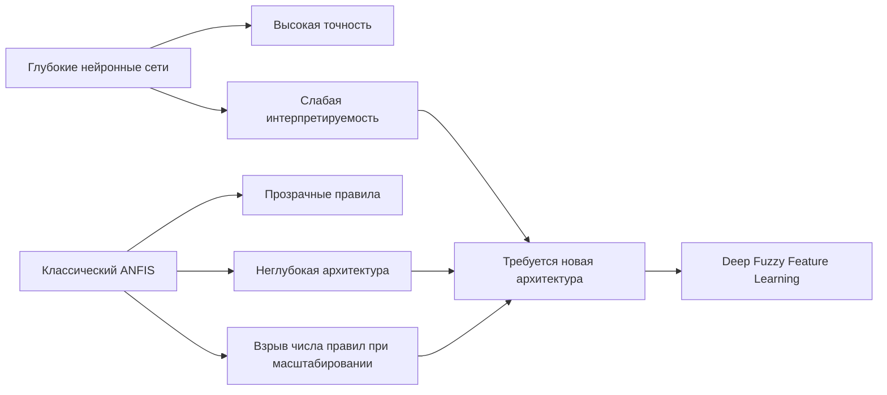
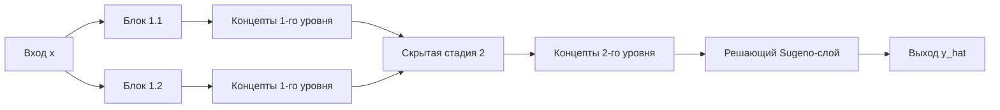
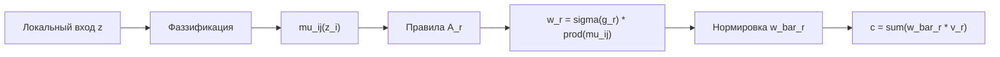
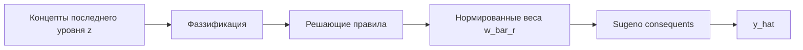
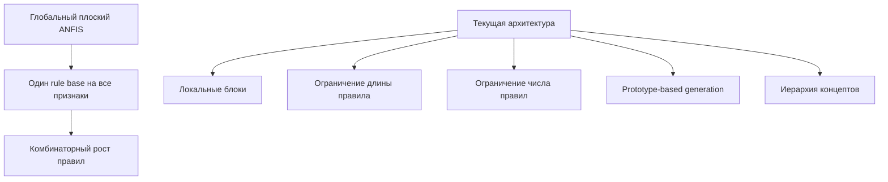
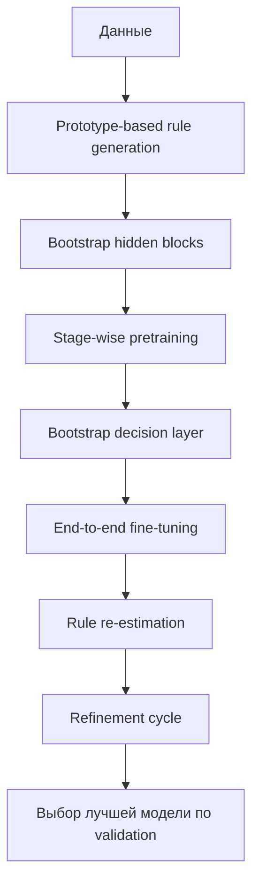
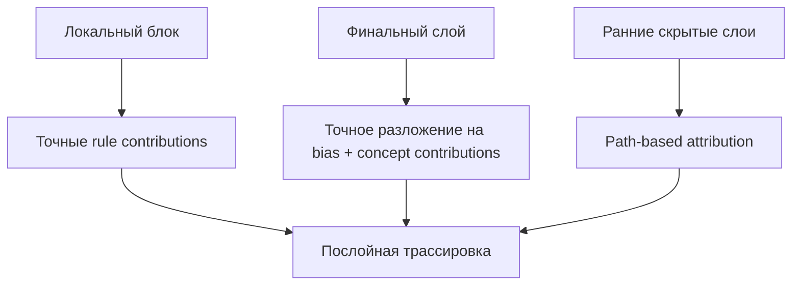
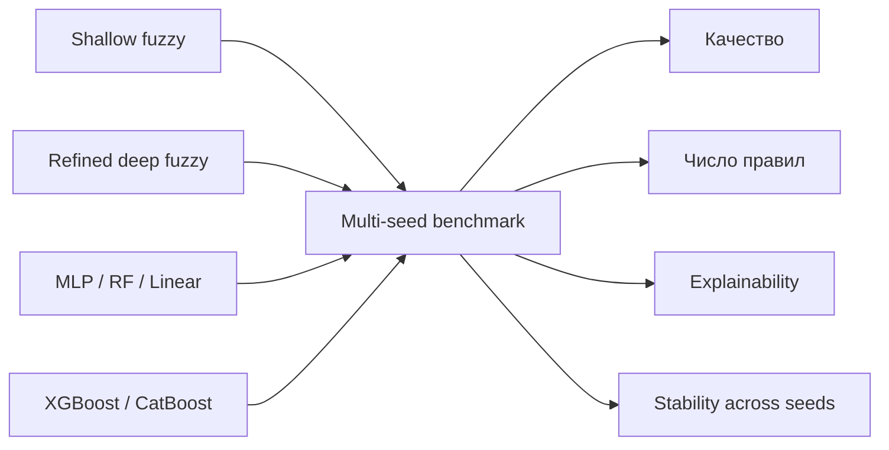
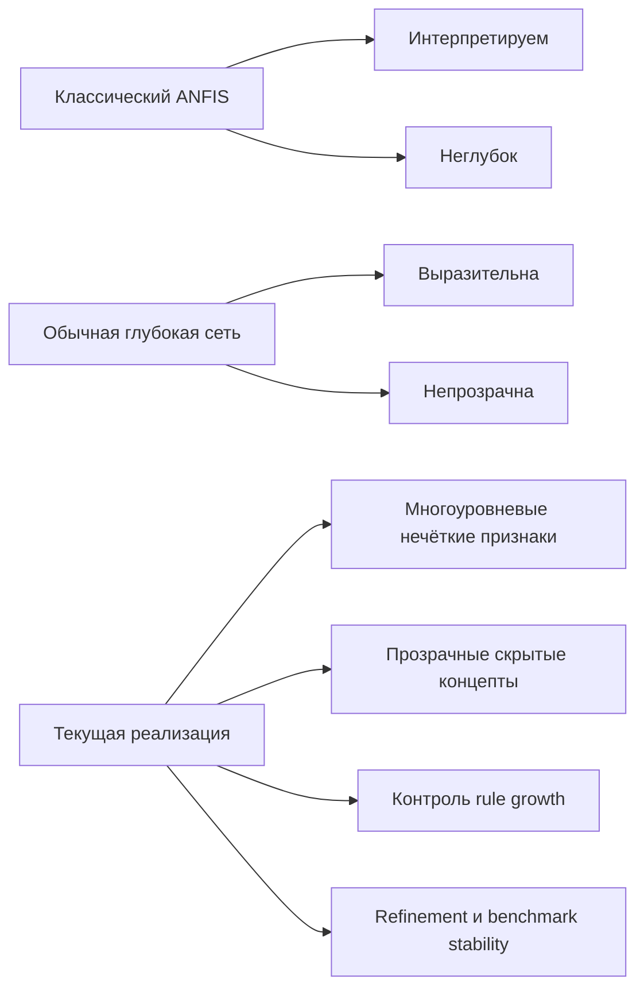
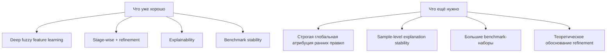

# Схемы для выступления

Ниже собраны схемы в формате `Mermaid`, которые можно напрямую использовать
в презентации, документации или быстро экспортировать в изображения.

Рекомендуемый набор для доклада:

1. постановка проблемы;
2. общая архитектура;
3. математика скрытого нечёткого блока;
4. контроль роста числа правил;
5. инициализация, предобучение и refinement;
6. объяснимость;
7. benchmark и устойчивость.

---

## Слайд 1. Проблема

Что говорить:
- классические глубокие модели точны, но непрозрачны;
- ANFIS интерпретируем, но неглубок;
- прямое углубление ANFIS приводит к комбинаторному росту правил;
- поэтому нужен переход к многоуровневому формированию нечётких признаков.

---

## Слайд 2. Общая архитектура

Что говорить:
- архитектура строится не как один глобальный rule base;
- первый уровень работает с локальными группами признаков;
- каждая стадия формирует интерпретируемые нечёткие концепты;
- финальный слой принимает решение по последнему концепт-пространству.

---

## Слайд 3. Математика скрытого блока

Основные формулы:

Для каждого признака `z_i` и терма `j`:

`mu_ij(z_i) in [0, 1]`

Вес правила:

`w_r = sigma(g_r) * product_(i,j in A_r) mu_ij(z_i)`

Нормировка:

`w_bar_r = w_r / (sum_q w_q + eps)`

Выход скрытого блока:

`c = sum_r w_bar_r v_r`

Что говорить:
- скрытый блок не выдаёт сразу итоговый прогноз;
- он строит новый вектор нечётких признаков;
- именно поэтому скрытые уровни остаются интерпретируемыми.

---

## Слайд 4. Финальный решающий слой

Формула финального слоя:

`y_hat = sum_r w_bar_r * (a_r0 + a_r^T z)`

Что говорить:
- скрытые слои у нас нулевого порядка;
- финальный слой первого порядка Sugeno;
- это даёт хороший баланс между интерпретируемостью и выразительностью.

---

## Слайд 5. Почему не происходит взрыва числа правил

Ключевая оценка:

Если у одного блока `p` входов и по `m` термов на вход, то полный перебор даёт:

`m^p`

Если ограничить длину правила числом `s`, то число кандидатов равно:

`sum_(k=1..s) C(p,k) m^k`

Что говорить:
- мы ограничиваем rule space конструктивно;
- сложность распределяется по уровням;
- вместо одного огромного rule base получаем набор управляемых локальных баз правил.

---

## Слайд 6. Построение модели по данным

Что говорить:
- верхние слои не строятся по случайным промежуточным представлениям;
- сначала стабилизируется concept space;
- затем rule base переоценивается на уже обученном представлении;
- refinement-loop повышает устойчивость и качество.

---

## Слайд 7. Объяснимость

Что говорить:
- внутри блока объяснение точное;
- на уровне финального решения есть точное разложение по концептам;
- для ранних слоёв пока используется path-based аппроксимация;
- это нужно честно проговаривать как ограничение текущей версии.

---

## Слайд 8. Benchmark и устойчивость

Что говорить:
- сравнение идёт не только по метрикам качества;
- мы сравниваем и сложность модели;
- и объяснимость;
- и устойчивость активных правил между разными запусками.

---

## Слайд 9. В чём преимущество текущей архитектуры

Что говорить:
- наша архитектура соединяет глубину и прозрачность;
- скрытые представления остаются нечёткими и интерпретируемыми;
- rule explosion ограничен конструктивно, а не постфактум.

---

## Слайд 10. Честные ограничения

Что говорить:
- это уже зрелая исследовательская архитектура;
- но не следует заявлять её как полностью общий deep stacked ANFIS;
- правильная формулировка: глубокое формирование нечётких признаков.

---

## Рекомендуемая логика выступления

1. Проблема: точность против интерпретируемости.
2. Почему классический ANFIS недостаточен.
3. Общая архитектура deep fuzzy feature learning.
4. Математика скрытого и финального слоя.
5. Как контролируется рост числа правил.
6. Как строится модель по данным.
7. Как устроена explainability.
8. Что показывают benchmark и stability.
9. Ограничения и план дальнейшего развития.

---

## Что лучше вывести на слайды как формулы

Минимальный набор:

`w_r = sigma(g_r) * product_(i,j in A_r) mu_ij(z_i)`

`w_bar_r = w_r / (sum_q w_q + eps)`

`c = sum_r w_bar_r v_r`

`y_hat = sum_r w_bar_r * (a_r0 + a_r^T z)`

Если нужен только один главный тезис:

`x -> fuzzy concepts -> deeper fuzzy concepts -> prediction`
